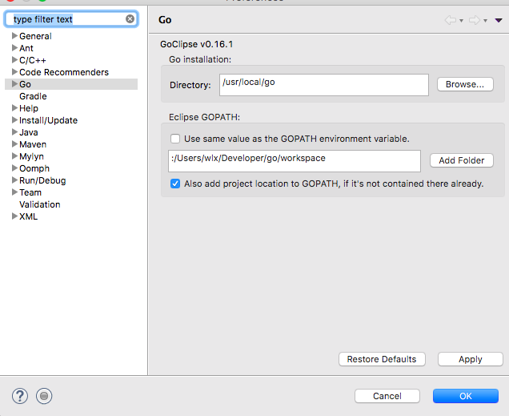
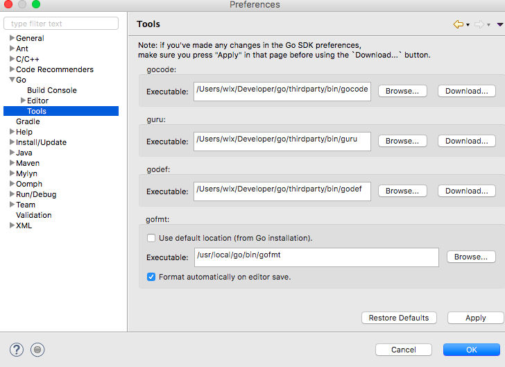
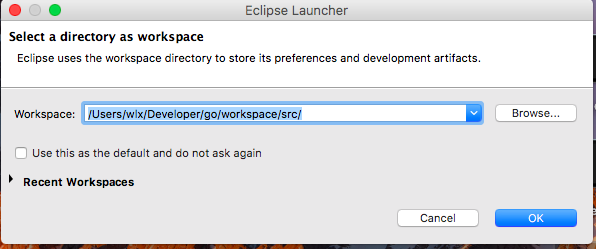
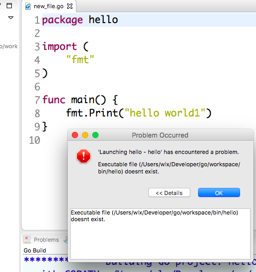
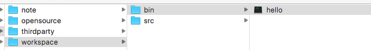
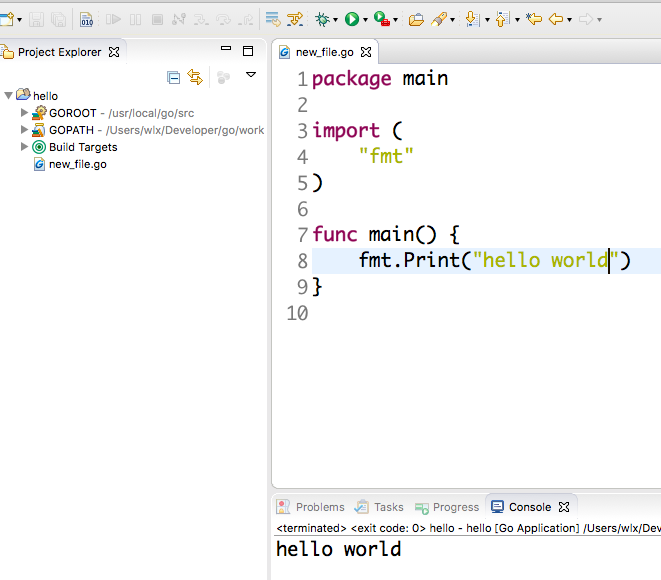
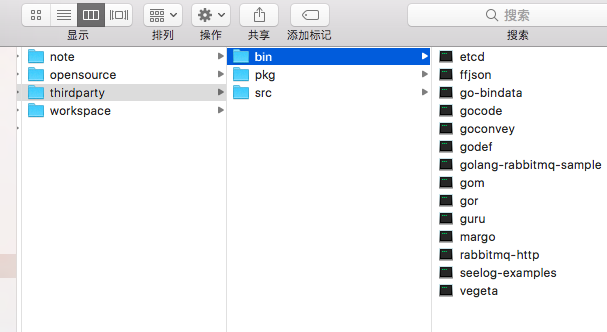

# GO语言爬坑笔记

### 1.使用eclipse开发Go语言

[官方安装指南](https://github.com/GoClipse/goclipse/blob/latest/documentation/Installation.md#installation)

安装过程可能由于墙的原因各种不成功，多试几次就OK了。直接安装Goclipse就可以了，其它的不需要。

​	之后进入偏好设置，进行如下图所示的操作。三个tools没有的直接点击下载就可以了，最后的fmt是自带的。go的安装目录和workdsapce写进去就OK了。完成这些操作之后，写代码就会有提示，并且还可以点到源码中去了。

 

常见问题：

1.我们的工作空间要放到worksapce/src下面，不然运行会出错。会遇到“[Resource doesn't have a corresponding Go package" ](http://stackoverflow.com/questions/34775953/golang-on-eclipse-resource-doesnt-have-a-corresponding-go-package-on-mac)的错误。

  

2.eclipse建立go文件的时候，不是自动生成main包的，所以我们必须把包名改成mian包，不然运行时会报错的，找不到可执行文件，因为没有main入口，所以无法生成可执行文件，改了就好了。第二个问题比较隐蔽，作为初学者困扰了以很久。然后还是看官方的helloworld教程才领悟过来的。

   

改了main之后，可以试着用命令行的形式 进入src目录，go install hello 可以生成bin/hello可执行文件。这样go文件是没什么的问题的。这时候点击eclipse的运行应该也没有问题。

正确的go代码，使用命令行构建的样子：

最后成功的示例：

补充内容：

​	[参考博客](http://www.cnblogs.com/yusenwu/p/5860189.html)

​	[golang 环境配置建议](http://studygolang.com/articles/2516)

​	[代码导航工具说明](http://www.jianshu.com/p/994e85e21135)

工具作用：gocode 提供代码补全 +godef 代码跳转+guru代码导航工具

 	

------------

